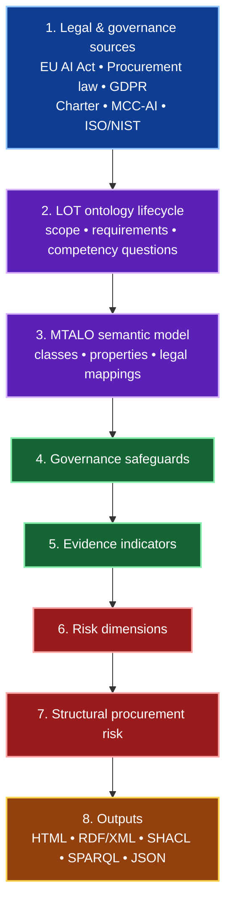

# Trustworthy AI Forensics (TAF)

### An ontology-supported framework for legally grounded procurement assessment of AI-enabled digital forensics tools

[](https://w3id.org/taf)
[](#semantic-web-outputs)
[](#status)
[](LICENSE)

> **TAF helps turn legal and procurement obligations into traceable governance safeguards, evidence indicators, and procurement-risk signals for AI systems used in digital forensics.**

**Quick links:** [Why TAF?](#why-taf) • [Framework Architecture](#framework-architecture) • [Framework Layers](#framework-layers) • [Traceability Chain](#traceability-chain) • [Semantic Web Outputs](#semantic-web-outputs) • [Roadmap](#roadmap)

---

## Why TAF?

AI-enabled forensic tools are increasingly procured, deployed, and trusted in high-stakes investigations.

Traditional procurement documents often focus on vendor functionality, price, and service terms, but may not clearly expose whether the tool operationalises safeguards such as:

- chain of custody and evidence integrity;
- provenance, logging, and traceability;
- human oversight and escalation;
- bias, representativeness, and data governance controls;
- cybersecurity, robustness, and resilience;
- transparency, auditability, and documentation.

**Trustworthy AI Forensics (TAF)** addresses this gap by modelling the relationship between legal provisions, procurement principles, governance safeguards, and textual evidence in procurement artefacts.

> **TAF is not a final compliance engine or legal opinion.**  
> It is a regulatory-learning and expert-review support framework for making procurement evidence more visible, structured, and auditable.

---

## Research contribution

TAF contributes an ontology-supported, legally grounded, deterministic screening framework for AI forensic tool procurement.

Instead of only asking whether a tool performs well, TAF asks:

> **Does the procurement documentation show enough evidence that the system can be governed, audited, challenged, and trusted in a forensic context?**

The framework translates legal and procurement expectations into reusable semantic structures:

| Layer | Contribution |
|---|---|
| **Legal interpretation** | Identifies operational requirements from AI, procurement, data-protection, and forensic-governance sources. |
| **Competency questions** | Turns legal requirements into reviewable questions that structure ontology scope. |
| **Governance safeguards** | Abstracts recurring obligations into reusable safeguard categories. |
| **Evidence indicators** | Links safeguards to detectable terms, phrases, and source-wired procurement evidence. |
| **Risk dimensions** | Aggregates missing or weak evidence into structural procurement-risk signals. |
| **Semantic exports** | Produces machine-readable ontology and validation artefacts for review and reuse. |

---

## Who is this for?

| Stakeholder | How TAF helps |
|---|---|
| **AI system providers** | Understand the evidence customers may expect in procurement documentation. |
| **Customers and deployers** | Assess whether vendor artefacts expose governance, oversight, and forensic safeguards. |
| **Regulators and policymakers** | Observe recurring documentation gaps and support regulatory-learning or sandbox preparation. |
| **Researchers** | Reuse the ontology, traceability chain, and evaluation method for trustworthy AI procurement research. |

---

## Framework architecture

### Visual overview



### Full architecture breakdown

If the GitHub Mermaid theme makes the diagram hard to read, here is the same architecture in plain text:

| Step | Component | What it does |
|---:|---|---|
| **1** | **Legal & governance sources** | Provides the normative foundation of the framework, including the **EU AI Act**, **procurement law**, **GDPR**, **Charter rights**, **MCC-AI**, and relevant **ISO/NIST** material. |
| **2** | **LOT ontology lifecycle** | Structures the ontology-engineering process through scope definition, requirements capture, and competency questions. |
| **3** | **MTALO semantic model** | Formalises the ontology through classes, properties, legal mappings, and semantic relations. |
| **4** | **Governance safeguards** | Identifies the governance controls and safeguards that should be evidenced in procurement artefacts. |
| **5** | **Evidence indicators** | Maps safeguards to specific textual indicators, phrases, or evidence signals found in procurement documentation. |
| **6** | **Risk dimensions** | Groups weak or missing evidence into broader governance-risk categories. |
| **7** | **Structural procurement risk** | Produces an interpretable procurement-risk signal based on the presence or absence of relevant evidence. |
| **8** | **Outputs** | Publishes results in both human-readable and machine-readable forms, including **HTML**, **RDF/XML**, **SHACL**, **SPARQL**, and **JSON** outputs. |

### Simple flow summary

```text
Legal & governance sources
    -> LOT ontology lifecycle
    -> MTALO semantic model
    -> Governance safeguards
    -> Evidence indicators
    -> Risk dimensions
    -> Structural procurement risk
    -> Outputs
```

> This dual presentation is intentional: the Mermaid diagram gives a quick visual summary, while the table guarantees readability in both GitHub light mode and dark mode.

---

## Framework layers

The generated TAF report is organised into six reporting layers. These are report and artefact layers; the LOT methodology is used as the ontology-engineering lifecycle inside the framework.

| # | Layer | Purpose |
|---:|---|---|
| **1** | **LOT ontology lifecycle / requirements layer** | Defines scope, stakeholders, use cases, competency questions, source materials, and maintenance points. |
| **2** | **MTALO semantic layer** | Formalises legal provisions, safeguards, principles, ontology classes, properties, and namespaces. |
| **3** | **TAF operational screening layer** | Produces contract records, coverage interpretation, legal assessment, traceability dashboards, and source-wired evidence tables. |
| **4** | **Validation / reporting layer** | Captures validation posture, TBox/ABox distinction, ground-truth planning, and ablation testing. |
| **5** | **Semantic export layer** | Publishes RDF/XML, SHACL-style shapes, SPARQL queries, JSON mappings, and ontology previews. |
| **6** | **Thesis finalisation and validation roadmap** | Documents remaining ontology-quality, expert-validation, and publication steps. |

---

## Traceability chain

TAF makes the evidence chain explicit:

```text
LegalProvision
  -> LegalSubProvision
  -> CompetencyQuestion
  -> GovernanceSafeguard
  -> EvidenceIndicator
  -> RiskDimension
  -> StructuralProcurementRisk
```

### Example interpretation path

```text
EU AI Act Article 10
  -> Data provenance and suitability
  -> Must documentation enable assessment of compliance?
  -> Forensic chain of custody and data integrity
  -> chain of custody, data provenance, hash verification, audit trail
  -> transparency / auditability risk
  -> structural procurement risk
```

The goal is to avoid a shallow jump from **law → keywords**.  
TAF inserts an interpretation layer so that legal intent is preserved before deterministic screening is applied.

---

## Core ontology vocabulary

| Concept | Meaning |
|---|---|
| `LegalProvision` | A source legal or regulatory provision relevant to AI-enabled forensic procurement. |
| `LegalSubProvision` | A more specific operational requirement extracted from a legal provision. |
| `CompetencyQuestion` | A review question used to test whether the ontology operationalises the requirement. |
| `GovernanceSafeguard` | A reusable safeguard category such as human oversight, logging, or data governance. |
| `EvidenceIndicator` | A detectable textual signal in procurement documentation. |
| `RiskDimension` | A governance-risk dimension affected by missing or weak evidence. |
| `StructuralProcurementRisk` | The resulting procurement-risk interpretation based on evidence coverage and safeguard strength. |

---

## Example safeguard areas

TAF currently focuses on evidence that supports trustworthy AI use in digital forensic contexts, including:

| Safeguard area | Example evidence indicators |
|---|---|
| **Forensic chain of custody and data integrity** | chain of custody, hash verification, secure acquisition, evidence integrity, audit trail |
| **Traceability and logging** | event logging, provenance tracking, timestamping, reconstruction, monitoring |
| **Human oversight** | human-in-the-loop, manual review, operator override, escalation, supervision |
| **Data governance** | data quality, data lineage, representativeness, retention, GDPR, data minimisation |
| **Accuracy, robustness, and cybersecurity** | validation, testing, benchmarking, resilience, vulnerability management |
| **Transparency and documentation** | technical documentation, instructions for use, service levels, supplier cooperation |

---

## Legal and governance sources

TAF is designed around selected legal, procurement, AI-governance, cybersecurity, and digital-forensic sources, including:

- **EU AI Act** — high-risk AI obligations relevant to risk management, data governance, logging, transparency, human oversight, accuracy, robustness, and cybersecurity.
- **Directive 2014/24/EU** — procurement fairness, equal treatment, transparency, proportionality, and documentation.
- **GDPR** — data protection, minimisation, provenance, and personal-data governance.
- **Charter of Fundamental Rights** — fundamental-rights risk visibility.
- **MCC-AI high-risk model clauses** — contractual controls and supplier obligations.
- **ISO/IEC 27037, 27041, and 27042** — digital forensic evidence handling and method assurance.
- **ISO/IEC 42001 and ISO MSS concepts** — AI management-system interpretation.
- **NIST AI RMF** — AI risk-management vocabulary and governance framing.

---

## Semantic Web outputs

The framework is intended to support both human review and machine-readable reuse.

| Artefact | Purpose |
|---|---|
| `mtalo_complete_protege_ready.rdf` | Protégé-targeted RDF/XML ontology export. |
| `mtalo_shapes.rdf` | SHACL-style validation constraints. |
| `mtalo_queries.rq` | SPARQL queries for inspecting ontology and ABox patterns. |
| `mtalo_export_manifest.json` | Export manifest and publication metadata. |
| `competency_questions.json` | Reviewable competency-question source file. |
| `mcc_ai_checker_output.html` | Human-readable report and audit dashboard. |

---

## Suggested repository layout

```text
taf/
├── README.md
├── LICENSE
├── ontology/
│   ├── mtalo_complete_protege_ready.rdf
│   ├── mtalo_shapes.rdf
│   └── mtalo_queries.rq
├── data/
│   ├── competency_questions.json
│   └── source_materials/
├── reports/
│   └── mcc_ai_checker_output.html
├── docs/
│   └── widoco/
└── scripts/
    └── mcc_ai_checker.py
```

---

## How to use

### View the public project

```text
https://w3id.org/taf
```

### Inspect the ontology

Open the RDF/XML export in Protégé or another OWL/RDF tool:

```text
ontology/mtalo_complete_protege_ready.rdf
```

### Run SPARQL review queries

Use the SPARQL query file to inspect relationships such as:

- legal provisions linked to safeguards;
- safeguards linked to evidence indicators;
- evidence indicators linked to risk dimensions;
- contract instances with missing or weak evidence;
- repeated structural procurement-risk patterns.

```text
ontology/mtalo_queries.rq
```

### Review the HTML report

Open the generated report to inspect the human-readable traceability dashboard:

```text
reports/mcc_ai_checker_output.html
```

---

## Status

TAF is a **research prototype** and PhD artefact.

Current status:

- ✅ LOT-aligned ontology lifecycle framing
- ✅ MTALO semantic model and vocabulary
- ✅ Legal-provision to safeguard traceability
- ✅ Contract evidence screening dashboard
- ✅ RDF/XML ontology export preview
- ✅ SHACL-style and SPARQL publication artefacts
- ⚠️ Expert validation still required
- ⚠️ Legal sufficiency classifications are experimental
- ⚠️ Manual clause-level review is required before legal conclusions

---

## Limitations

TAF deliberately avoids claiming automated legal compliance.

Known limitations include:

- legal source coverage may be incomplete;
- semantic matching may miss procurement wording that differs from the ontology vocabulary;
- evidence indicators can generate false positives without expert review;
- supplier documentation quality affects the assessment;
- legal sufficiency remains an experimental research classification;
- the framework supports review, not final conformity assessment.

---

## Roadmap

- [ ] Publish the stable ontology namespace under `https://w3id.org/taf#`
- [ ] Add complete RDF/XML, Turtle, and JSON-LD exports
- [ ] Generate full WiDoco ontology documentation
- [ ] Expand SHACL validation profiles
- [ ] Add SPARQL examples and query documentation
- [ ] Add sample anonymised procurement records
- [ ] Add expert-validation protocol and scoring rubric
- [ ] Add CI checks for ontology consistency and broken links
- [ ] Add release tags for thesis artefact versions

---

## Citation

```bibtex
@misc{mccabe_taf,
  author       = {McCabe, Darren},
  title        = {Trustworthy AI Forensics (TAF): An ontology-supported framework for AI forensic tool procurement governance},
  howpublished = {\url{https://w3id.org/taf}},
  year         = {2026},
  note         = {Research prototype / PhD artefact}
}
```

---

## License

This project is released under the [MIT License](LICENSE).

---

**Trustworthy AI Forensics (TAF)**  
*Making AI forensic procurement evidence visible, traceable, and reviewable.*
