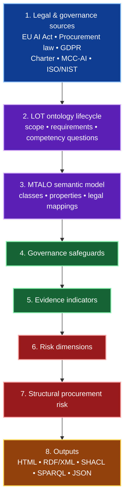

<div align="center">

# Trustworthy AI Forensics (TAF)

### *An ontology-supported framework for legally grounded procurement assessment of AI-enabled digital forensics tools*

[](https://w3id.org/taf)
[](#semantic-web-outputs)
[](#project-status)
[](LICENSE)
[](http://trinners.com/)

**Making AI forensic procurement evidence visible, traceable, and reviewable.**

**PhD research artefact — Trinity College Dublin**

[Why TAF](#why-taf) •
[Live Demo](#live-demo--report-highlights) •
[Framework Architecture](#framework-architecture) •
[Framework Layers](#framework-layers) •
[Traceability Chain](#traceability-chain) •
[Expert Validation](#expert-validation-for-the-phd) •
[Semantic Web Outputs](#semantic-web-outputs) •
[Thesis Readiness](#thesis-readiness-roadmap)

</div>

---

<div align="center">

## 📘 TAF Research Artefact Book

### *Open the framework as a structured research artefact, not just a repository.*

</div>

<table>
<tr>
<td width="34%" valign="top">

### 📕 What TAF is

**Trustworthy AI Forensics** is a PhD research artefact for assessing whether AI-forensic procurement documentation contains enough evidence of governance, oversight, transparency, and forensic reliability.

It links:

`law -> safeguards -> evidence -> risk`

</td>
<td width="33%" valign="top">

### 📗 What the artefact contains

- ✅ LOT lifecycle framing  
- ✅ MTALO ontology model  
- ✅ Competency questions  
- ✅ RDF/XML export  
- ✅ SHACL-style artefacts  
- ✅ SPARQL query pack  
- ✅ WiDoco documentation  
- ✅ HTML evidence dashboard  

</td>
<td width="33%" valign="top">

### 📙 What to review first

1. **Live demo/report**  
2. **Framework architecture**  
3. **Traceability chain**  
4. **Expert validation section**  
5. **Semantic Web outputs**  
6. **Thesis readiness roadmap**

Start here: [`https://w3id.org/taf`](https://w3id.org/taf)  
Demo: [`http://trinners.com/`](http://trinners.com/) this is password protected until the paper is published

</td>
</tr>
</table>

<details>
<summary><strong>📖 Open the TAF artefact book contents</strong></summary>

| Chapter | What it explains |
|---:|---|
| **1. Problem** | Why AI-forensic procurement needs a structured evidence review. |
| **2. Legal grounding** | How EU AI Act, procurement, GDPR, Charter, MCC-AI, ISO/NIST, and forensic sources are used. |
| **3. Ontology model** | How MTALO represents legal provisions, safeguards, evidence indicators, and risk dimensions. |
| **4. Traceability chain** | How TAF links law to governance safeguards and documentary evidence. |
| **5. Evidence dashboard** | How procurement records are screened and reported. |
| **6. Semantic exports** | How RDF/XML, SHACL, SPARQL, JSON, and WiDoco support reuse. |
| **7. PhD validation** | What expert validation is still required, and what the bare minimum should cover. |
| **8. Roadmap** | What is done, partly done, and still required for final thesis packaging. |

</details>

---

> [!IMPORTANT]
> **TAF helps turn legal and procurement obligations into traceable governance safeguards, evidence indicators, and procurement-risk signals for AI systems used in digital forensics.**
>
> TAF is **not** a final compliance engine or legal opinion.  
It is a **research and expert-review support framework** to make procurement evidence more visible, structured, and auditable.

---

## Why TAF?

AI-enabled forensic tools are increasingly procured, deployed, and trusted in high-stakes investigations.

Traditional procurement documents often focus on vendor functionality, price, and service terms, but may not clearly expose whether the tool operationalises safeguards such as:

- chain of custody and evidence integrity;
- provenance, logging, and traceability;
- human oversight and escalation;
- bias, representativeness, and data-governance controls;
- cybersecurity, robustness, and resilience;
- transparency, auditability, and documentation.

**Trustworthy AI Forensics (TAF)** addresses this gap by modelling the relationships among legal provisions, procurement principles, governance safeguards, and textual evidence within procurement artefacts.

---

## At a glance

| Area | Summary |
|---|---|
| **Problem** | Procurement documentation may not clearly show whether AI-enabled forensic tools are governable, auditable, and trustworthy. |
| **TAF response** | TAF translates legal and governance expectations into ontology-backed safeguards, evidence indicators, and risk signals. |
| **Primary contribution** | A legally grounded, deterministic, ontology-supported screening framework for AI-forensic procurement artefacts. |
| **Outputs** | HTML dashboards, RDF/XML, SHACL-style artefacts, SPARQL queries, JSON mappings, and traceability structures. |
| **Research value** | Supports expert review, reproducibility, semantic traceability, and structured legal/governance interpretation. |

---

## Live demo & report highlights

### Demo links

- **Project identifier / landing page:** [`https://w3id.org/taf`](https://w3id.org/taf)
- **Live demo URL:** [`http://trinners.com/`](http://trinners.com/) this is password protected until the paper is published

### What the HTML report already shows

The current HTML artefact already goes beyond a simple static report. It includes operational sections and dashboards such as:

| Report area | Current status | Notes |
|---|---|---|
| **3.3.1 Procurement use-case demonstration** | ✅ Done | Demonstrates how the framework can be applied in a procurement context. |
| **3.3.2 Cross-contract comparison** | ✅ Done | Compares contracts across the processed dataset. |
| **3.3.3 Cross-contract decision dashboard** | ✅ Done | Includes dataset risk distributions and decision-support style outputs. |
| **3.3.4 Legal sufficiency assessment table** | ✅ Done | Obligation-by-obligation mapping from legal provision to safeguard, detection strength, source quality, and experimental legal sufficiency. |
| **3.3.5 Full traceability chain by contract** | ✅ Done | Shows what each contract evidences, what is missing, and how legal obligations flow through the ontology to structural procurement risk. |
| **3.3.6 Full Source-Wired Traceability Table** | ✅ Done | Full audit trail across legal provision, safeguard, evidence indicator, matched keywords, snippets, source quality, gap status, and procurement action. |
| **Governance safeguard heatmap** | ✅ Done | Audit-style heatmap showing where governance strength and weakness cluster across procurement risk dimensions. |
| **Legal review panel** | ✅ Done | Separates legal scope from legal sufficiency and shows where manual legal review is still required. |
| **Confidence, negation, and false-positive controls** | ✅ Done | Explicit controls are present in the report structure. |

<details>
<summary><strong>More detail from the current HTML report</strong></summary>

### Legal sufficiency and traceability outputs

The report already includes these visible sections:

- **3.3.4 Legal sufficiency assessment table**
- **3.3.5 Full traceability chain by contract**
- **3.3.6 Show full Source-Wired Traceability Table**

These sections support:
- obligation-by-obligation assessment;
- contract-level traceability;
- source-wired auditability;
- mapping from legal provision to operational safeguard;
- evidence indicator and procurement-action visibility.

### Governance safeguard heatmap

The HTML report includes a **Governance safeguard heatmap** with the note that:

- each row is a **governance safeguard**;
- each column is a **procurement risk dimension**;
- **green** indicates evidenced;
- **amber** indicates partial or mixed evidence;
- **red** indicates missing evidence;
- **grey** indicates not applicable in the current trace.

This is important because it gives an **audit-style view of where governance strength and weakness cluster**.

### Legal review panel

The HTML report also includes a **Legal Review Panel - Coverage Scope** that separates:

- **legal scope**
- **legal sufficiency**

It shows that:
- ticks indicate mapped safeguards with stronger evidence;
- warnings indicate partial operationalisation;
- crosses indicate gaps requiring manual legal review.

The panel shown in the report covers:
- **EU AI Act / AI Act scope**
- **Public procurement law**
- **Digital forensics safeguards**

It also shows **Procurement contracts processed (ABox): 3 active workbook contracts**.

</details>

---


## Research contribution

TAF contributes an ontology-supported, legally grounded, deterministic screening framework for AI-forensic tool procurement.

Instead of only asking whether a tool performs well, TAF asks:

> **Does the procurement documentation show enough evidence that the system can be governed, audited, challenged, and trusted in a forensic context?**

The framework translates legal and procurement expectations into reusable semantic structures:

| Layer | Contribution |
|---|---|
| **Legal interpretation** | Identifies operational requirements from AI, procurement, data-protection, and forensic-governance sources. |
| **Competency questions** | Turns legal requirements into reviewable questions that structure ontology scope. |
| **Governance safeguards** | Abstracts recurring obligations into reusable safeguard categories. |
| **Evidence indicators** | Links safeguards to detectable terms, phrases, and source-wired procurement evidence. |
| **Risk dimensions** | Aggregates missing or weak evidence into structural procurement-risk signals. |
| **Semantic exports** | Produces machine-readable ontology and validation artefacts for review and reuse. |

---

## Framework architecture

### Visual overview



<details>
<summary><strong>Can’t read the Mermaid diagram clearly on GitHub?</strong> Click for the full architecture breakdown.</summary>

### Full architecture breakdown

| Step | Component | What it does |
|---:|---|---|
| **1** | **Legal & governance sources** | Provides the normative foundation of the framework, including the **EU AI Act**, **procurement law**, **GDPR**, **Charter rights**, **MCC-AI**, and relevant **ISO/NIST** material. |
| **2** | **LOT ontology lifecycle** | Structures the ontology-engineering process through scope definition, requirements capture, and competency questions. |
| **3** | **MTALO semantic model** | Formalises the ontology through classes, properties, legal mappings, and semantic relations. |
| **4** | **Governance safeguards** | Identifies the governance controls and safeguards that should be evidenced in procurement artefacts. |
| **5** | **Evidence indicators** | Maps safeguards to specific textual indicators, phrases, or evidence signals found in procurement documentation. |
| **6** | **Risk dimensions** | Groups weak or missing evidence into broader governance-risk categories. |
| **7** | **Structural procurement risk** | Produces an interpretable procurement-risk signal based on the presence or absence of relevant evidence. |
| **8** | **Outputs** | Publishes results in both human-readable and machine-readable forms, including **HTML**, **RDF/XML**, **SHACL**, **SPARQL**, and **JSON** outputs. |

### Simple flow summary

```text
Legal & governance sources
    -> LOT ontology lifecycle
    -> MTALO semantic model
    -> Governance safeguards
    -> Evidence indicators
    -> Risk dimensions
    -> Structural procurement risk
    -> Outputs
```

</details>

---

## Framework layers

The generated TAF report is organised into six reporting layers. These are report and artefact layers; the LOT methodology is used as the ontology-engineering lifecycle inside the framework.

| # | Layer | Purpose |
|---:|---|---|
| **1** | **LOT ontology lifecycle / requirements layer** | Defines scope, stakeholders, use cases, competency questions, source materials, and maintenance points. |
| **2** | **MTALO semantic layer** | Formalises legal provisions, safeguards, principles, ontology classes, properties, and namespaces. |
| **3** | **TAF operational screening layer** | Produces contract records, coverage interpretation, legal assessment, traceability dashboards, and source-wired evidence tables. |
| **4** | **Validation / reporting layer** | Captures validation posture, TBox/ABox distinction, ground-truth planning, and ablation testing. |
| **5** | **Semantic export layer** | Publishes RDF/XML, SHACL-style shapes, SPARQL queries, JSON mappings, and ontology previews. |
| **6** | **Thesis finalisation and validation roadmap** | Documents remaining ontology-quality, expert-validation, and publication steps. |

---

## Traceability chain

TAF makes the evidence chain explicit:

```text
LegalProvision
  -> LegalSubProvision
  -> CompetencyQuestion
  -> GovernanceSafeguard
  -> EvidenceIndicator
  -> RiskDimension
  -> StructuralProcurementRisk
```

### Example interpretation path

```text
EU AI Act Article 10
  -> Data provenance and suitability
  -> Must documentation enable assessment of compliance?
  -> Forensic chain of custody and data integrity
  -> chain of custody, data provenance, hash verification, audit trail
  -> transparency / auditability risk
  -> structural procurement risk
```

The goal is to avoid a shallow jump from **law -> keywords**.  
TAF inserts an interpretation layer so that legal intent is preserved before deterministic screening is applied.

---

<details>
<summary><strong>Who is this for?</strong></summary>

| Stakeholder | How TAF helps |
|---|---|
| **AI system providers** | Understand the evidence customers may expect in procurement documentation. |
| **Customers and deployers** | Assess whether vendor artefacts expose governance, oversight, and forensic safeguards. |
| **Regulators and policymakers** | Observe recurring documentation gaps and support regulatory-learning or sandbox preparation. |
| **Researchers** | Reuse the ontology, traceability chain, and evaluation method for trustworthy AI procurement research. |

</details>

<details>
<summary><strong>Core ontology vocabulary</strong></summary>

| Concept | Meaning |
|---|---|
| `LegalProvision` | A source legal or regulatory provision relevant to AI-enabled forensic procurement. |
| `LegalSubProvision` | A more specific operational requirement extracted from a legal provision. |
| `CompetencyQuestion` | A review question used to test whether the ontology operationalises the requirement. |
| `GovernanceSafeguard` | A reusable safeguard category such as human oversight, logging, or data governance. |
| `EvidenceIndicator` | A detectable textual signal in procurement documentation. |
| `RiskDimension` | A governance-risk dimension affected by missing or weak evidence. |
| `StructuralProcurementRisk` | The resulting procurement-risk interpretation based on evidence coverage and safeguard strength. |

</details>

<details>
<summary><strong>Example safeguard areas</strong></summary>

| Safeguard area | Example evidence indicators |
|---|---|
| **Forensic chain of custody and data integrity** | chain of custody, hash verification, secure acquisition, evidence integrity, audit trail |
| **Traceability and logging** | event logging, provenance tracking, timestamping, reconstruction, monitoring |
| **Human oversight** | human-in-the-loop, manual review, operator override, escalation, supervision |
| **Data governance** | data quality, data lineage, representativeness, retention, GDPR, data minimisation |
| **Accuracy, robustness, and cybersecurity** | validation, testing, benchmarking, resilience, vulnerability management |
| **Transparency and documentation** | technical documentation, instructions for use, service levels, supplier cooperation |

</details>

<details>
<summary><strong>Legal and governance sources</strong></summary>

TAF is designed around selected legal, procurement, AI-governance, cybersecurity, and digital-forensic sources, including:

- **EU AI Act** — high-risk AI obligations relevant to risk management, data governance, logging, transparency, human oversight, accuracy, robustness, and cybersecurity.
- **Directive 2014/24/EU** — procurement fairness, equal treatment, transparency, proportionality, and documentation.
- **GDPR** — data protection, minimisation, provenance, and personal-data governance.
- **Charter of Fundamental Rights** — fundamental-rights risk visibility.
- **MCC-AI high-risk model clauses** — contractual controls and supplier obligations.
- **ISO/IEC 27037, 27041, and 27042** — digital forensic evidence handling and method assurance.
- **ISO/IEC 42001 and ISO MSS concepts** — AI management-system interpretation.
- **NIST AI RMF** — AI risk-management vocabulary and governance framing.

</details>

---

## Semantic Web outputs

The framework is intended to support both human review and machine-readable reuse.

| Artefact | Purpose | Status |
|---|---|---|
| `mtalo_complete_protege_ready.rdf` | Protégé-targeted RDF/XML ontology export | ✅ Done |
| `mtalo_complete_protege_ready_validation.json` | Validation JSON showing the export ran and contains expected structures | ✅ Done |
| `mtalo_shapes.rdf` | SHACL-style validation constraints | ✅ Done |
| `mtalo_queries.rq` | SPARQL query pack for inspecting ontology and ABox patterns | ✅ Done |
| `mtalo_export_manifest.json` | Export manifest, provenance, and reproducibility metadata | ✅ Done |
| `competency_questions.json` | Reviewable competency-question source file | ✅ Done |
| `mcc_ai_checker_output.html` | Human-readable report and audit dashboard | ✅ Done |
| `docs/widoco/` | Full WiDoco ontology documentation | ✅ Done |

<details>
<summary><strong>Suggested repository layout</strong></summary>

```text
taf/
├── README.md
├── LICENSE
├── ontology/
│   ├── mtalo_complete_protege_ready.rdf
│   ├── mtalo_complete_protege_ready_validation.json
│   ├── mtalo_shapes.rdf
│   ├── mtalo_queries.rq
│   └── mtalo_export_manifest.json
├── data/
│   ├── competency_questions.json
│   └── source_materials/
├── reports/
│   └── mcc_ai_checker_output.html
├── docs/
│   └── widoco/
│       └── index-en.html
└── scripts/
    └── mcc_ai_checker.py
```

</details>

---

## How to use

<details open>
<summary><strong>Open usage guidance</strong></summary>

### View the public project

```text
https://w3id.org/taf
```

### Inspect the ontology

Open the RDF/XML export in Protégé or another OWL/RDF tool:

```text
ontology/mtalo_complete_protege_ready.rdf
```

### Run SPARQL review queries

Use the SPARQL query file to inspect relationships such as:

- legal provisions linked to safeguards;
- safeguards linked to evidence indicators;
- evidence indicators linked to risk dimensions;
- contract instances with missing or weak evidence;
- repeated structural procurement-risk patterns.

```text
ontology/mtalo_queries.rq
```

### Review the HTML report

Open the generated report to inspect the human-readable traceability dashboard:

```text
reports/mcc_ai_checker_output.html
```

</details>

---

## Project status

### Summary

| Area | Status | Meaning |
|---|---|---|
| **Overall maturity** | 🟡 Research prototype | Strong thesis artefact, not a production compliance product. |
| **LOT lifecycle framing** | ✅ Done | Requirements, scope, competency questions, reuse, implementation, publication, and maintenance are represented. |
| **MTALO semantic model** | ✅ Done | Classes, properties, vocabulary, namespace policy, and ontology structure are implemented. |
| **Operational screening** | ✅ Done | Legal provisions, safeguards, evidence indicators, risk dimensions, and procurement-risk outputs are linked. |
| **HTML reporting** | ✅ Done | Human-readable report and traceability dashboard are generated. |
| **Semantic export package** | ✅ Done | RDF/XML, validation JSON, SHACL, SPARQL, and manifest artefacts exist. |
| **WiDoco documentation** | ✅ Done | Full ontology documentation is treated as completed in this README. |
| **Expert validation** | 🟡 Minimum still required | Needed for PhD research claims, not for proving the code or README exists. |
| **Automated legal conclusions** | ❌ Not claimed | TAF supports review; it does not replace legal assessment. |

### Completed / implemented in the current prototype

- ✅ LOT-aligned ontology lifecycle framing
- ✅ MTALO semantic model and vocabulary
- ✅ Legal-provision to governance-safeguard traceability
- ✅ Competency-question driven requirements structure
- ✅ Contract evidence screening dashboard
- ✅ Legal-provision -> safeguard -> evidence-indicator -> risk-dimension mapping
- ✅ Cross-contract comparison and decision-support reporting
- ✅ Legal sufficiency assessment table (3.3.4)
- ✅ Full traceability chain by contract (3.3.5)
- ✅ Full Source-Wired Traceability Table (3.3.6)
- ✅ Governance safeguard heatmap
- ✅ Legal review panel / coverage-scope panel
- ✅ Source-wired traceability table
- ✅ RDF/XML ontology export preview
- ✅ RDF/XML validation JSON
- ✅ SHACL-style validation artefacts
- ✅ SPARQL query pack
- ✅ JSON mapping / manifest-style publication artefacts
- ✅ DetectionGap ontology / semantic-export plumbing
- ✅ Human-readable HTML report output
- ✅ Full WiDoco ontology documentation

### Still experimental

- ⚠️ Legal sufficiency labels remain research classifications.
- ⚠️ Deterministic evidence matching can miss equivalent wording or create false positives.
- ⚠️ Risk dimensions still require expert review before being treated as validated.
- ⚠️ Manual clause-level review is required before legal or procurement conclusions.

---

## Expert validation for the PhD

### Bare minimum for PhD-level validation

For a defensible PhD minimum, TAF should include a **small, structured expert-validation exercise** focused on the interpretation layers of the framework.

| Minimum element | Recommended target |
|---|---|
| **Expert count** | **5 to 8 experts** |
| **Coverage** | Mix of AI governance, digital forensics, procurement / procurement law, and legal / regulatory interpretation |
| **Method** | Structured review form with scoring and free-text comments |
| **Scoring** | 1-5 scale for relevance, clarity, completeness, and correctness |
| **Evidence captured** | Expert scores, comments, disagreement points, accepted changes, and unresolved limitations |
| **Output** | A short validation chapter / appendix summarising results and refinements |

### Best validation focus for the PhD

The strongest minimum validation is not to ask experts whether they “like the tool”.  
It is to validate the **traceability chain** and the **competency-question design**.

| Priority | Validation target | What experts should check | Why it matters |
|---:|---|---|---|
| **1** | **Competency questions** | Are the questions clear, answerable, relevant, and complete enough to assess AI-forensic procurement evidence? | This is the best PhD validation target because the competency questions connect the legal problem to the ontology scope. |
| **2** | **LegalProvision -> LegalSubProvision mapping** | Are the legal anchors and sub-provisions interpreted fairly? | Prevents weak or exaggerated legal interpretation. |
| **3** | **LegalSubProvision -> CompetencyQuestion mapping** | Does each question actually test the legal requirement it claims to operationalise? | Shows that the ontology is requirement-driven, not just keyword-driven. |
| **4** | **CompetencyQuestion -> GovernanceSafeguard mapping** | Does the safeguard logically answer the competency question? | Validates the core conceptual bridge in TAF. |
| **5** | **GovernanceSafeguard -> EvidenceIndicator mapping** | Are the keywords / evidence phrases reasonable signals of documentary evidence? | Reduces false positives and missing indicators. |
| **6** | **EvidenceIndicator -> RiskDimension mapping** | Is the assigned risk dimension appropriate when evidence is missing or weak? | Validates the risk interpretation layer. |
| **7** | **Worked examples / ABox instances** | Are the example procurement records interpreted consistently and fairly? | Demonstrates that the framework can be applied, not just described. |
| **8** | **Ontology structure** | Are the classes, properties, TBox/ABox split, RDF/XML export, SHACL shapes, and SPARQL queries understandable and defensible? | Supports the semantic-web contribution. |

### Validation snapshot

| Validation element | Current status | PhD value |
|---|---|---|
| Framework prototype implemented | ✅ Done | Demonstrates that TAF is operational, not only conceptual. |
| LOT lifecycle and requirements structure | ✅ Done | Shows methodological grounding. |
| Competency questions exported / reviewable | ✅ Done | Best candidate for focused expert validation. |
| Legal-provision to safeguard chain implemented | ✅ Done | Shows traceability from law to governance interpretation. |
| Evidence-indicator mapping implemented | ✅ Done | Enables deterministic screening and expert review of keyword choices. |
| Risk-dimension mapping implemented | ✅ Done | Supports structured procurement-risk interpretation. |
| RDF/XML + SHACL + SPARQL + manifest package | ✅ Done | Supports semantic-web artefact contribution. |
| WiDoco ontology documentation | ✅ Done | Supports human-readable ontology publication. |
| Expert-validation protocol | ⬜ Still to do | Needed for thesis defensibility. |
| Expert review exercise | ⬜ Still to do | Needed to validate interpretation quality. |
| Final validation write-up | ⬜ Still to do | Needed for the thesis evaluation chapter / appendix. |

### What expert validation is still required for

Expert validation is **not** required to prove that the code runs, that the README exists, or that the artefacts are generated.  
It is required for the **research claims and interpretation layers** of the framework.

| Validation area | Why expert input is needed |
|---|---|
| **Legal interpretation** | To confirm that the selected EU AI Act, procurement, GDPR, Charter, MCC-AI, ISO/NIST, and forensic-governance sources are interpreted appropriately. |
| **Competency questions** | To confirm that the questions are relevant, complete, answerable, and suitable for assessing AI-forensic procurement evidence. |
| **Ontology modelling choices** | To confirm that MTALO classes, properties, and relationships are meaningful to legal, procurement, AI-governance, and digital-forensic reviewers. |
| **Safeguard mapping** | To confirm that legal requirements are mapped to suitable governance safeguards rather than superficial keyword categories. |
| **Evidence indicators** | To confirm that selected keywords and phrases are reasonable signals of procurement evidence, and to identify missing or misleading indicators. |
| **Risk dimensions** | To confirm that missing evidence is assigned to appropriate risk dimensions. |
| **Legal sufficiency labels** | To confirm whether labels such as sufficient, partial, weak, or missing are defensible as research classifications. |
| **Worked examples / ABox instances** | To confirm that example procurement records are interpreted fairly and consistently. |

---

## Limitations

TAF deliberately avoids claiming automated legal compliance.

Known limitations include:

- legal source coverage may be incomplete;
- semantic matching may miss procurement wording that differs from the ontology vocabulary;
- evidence indicators can generate false positives without expert review;
- supplier documentation quality affects the assessment;
- legal sufficiency remains an experimental research classification;
- the framework supports review, not final conformity assessment.

---

## Thesis readiness roadmap

This roadmap is written for a **Trinity College Dublin PhD research artefact**.  
It separates what is already implemented from what still needs to be completed for final thesis submission, validation, and reproducibility.

### Status legend

| Symbol | Meaning |
|---|---|
| ✅ | Completed in the current prototype |
| 🟡 | Partly implemented / needs refinement |
| ⬜ | Still to complete |
| ❌ | Not claimed / deliberately out of scope |

### Implemented artefact components

| Component | Status | Evidence in current artefact |
|---|---:|---|
| Public project identifier via `https://w3id.org/taf` | ✅ | Persistent project entry point available |
| GitHub README and project description | ✅ | Public documentation available |
| LOT methodology / ontology lifecycle framing | ✅ | Requirements, scope, competency questions, reuse, implementation, publication, and maintenance are represented |
| MTALO ontology vocabulary | ✅ | Core classes, properties, and semantic model implemented |
| Competency-question driven requirements structure | ✅ | Competency questions are present and reviewable |
| Legal-provision to safeguard traceability | ✅ | Legal provisions are mapped to governance safeguards |
| Safeguard to evidence-indicator mapping | ✅ | Governance safeguards are linked to evidence indicators |
| Evidence-indicator to risk-dimension mapping | ✅ | Evidence gaps are linked to procurement-risk dimensions |
| Contract evidence screening dashboard | ✅ | HTML report provides contract-level screening outputs |
| Legal sufficiency assessment table `3.3.4` | ✅ | Obligation-by-obligation sufficiency table is present |
| Full traceability chain by contract `3.3.5` | ✅ | Contract-level legal-to-risk traceability is present |
| Full Source-Wired Traceability Table `3.3.6` | ✅ | Full audit trail is present |
| Governance safeguard heatmap | ✅ | Governance strength / weakness clustering is present |
| Legal review panel / coverage scope | ✅ | Legal scope and sufficiency are separated |
| RDF/XML ontology export | ✅ | Ontology export package exists |
| RDF/XML validation JSON | ✅ | Export validation artefact exists |
| SHACL-style validation artefacts | ✅ | Shape artefacts exist |
| SPARQL query pack | ✅ | Query artefacts exist |
| JSON mapping / export manifest artefacts | ✅ | Manifest and mapping artefacts exist |
| Full WiDoco ontology documentation | ✅ | Completed |
| Human-readable HTML report output | ✅ | Dashboard/report output exists |

### Refinement before final submission

| Component | Status | What still needs refinement |
|---|---:|---|
| Stable ontology namespace under `https://w3id.org/taf#` | 🟡 | URI policy exists, but final namespace publication should be hardened for thesis release |
| Turtle and JSON-LD exports | 🟡 | RDF/XML exists; extra serialisations can be added for reuse and interoperability |
| SHACL validation profiles | 🟡 | Prototype checks exist; fuller domain-specific validation rules can be added |
| SPARQL documentation | 🟡 | Query pack exists; explanatory examples should be added |
| ABox serialisation | 🟡 | Worked examples exist; full run-wide serialisation can be expanded |
| Provenance coverage | 🟡 | Baseline provenance exists; every evidence row can be given stronger lineage |
| Versioned thesis packages | 🟡 | Needs final release packaging and archival structure |

### Remaining PhD validation work

| Component | Status | Why it matters |
|---|---:|---|
| Expert-validation protocol | ⬜ | Defines reviewer profile, scoring criteria, and review procedure |
| Expert review exercise | ⬜ | Provides minimum empirical validation of the interpretation layer |
| Competency-question validation | ⬜ | Confirms the questions are relevant, complete, clear, and answerable |
| Mapping validation | ⬜ | Confirms legal provisions, safeguards, indicators, and risk dimensions are linked defensibly |
| Final validation write-up / appendix | ⬜ | Converts expert feedback into thesis evidence |
| Official final OOPS! validation evidence | ⬜ | Adds external ontology-quality evidence for the final RDF export |
| CI checks for RDF, SHACL, SPARQL, and broken links | ⬜ | Improves reproducibility and public maintainability |
| GitHub release tags for thesis artefact versions | ⬜ | Makes the final submitted artefact citable and reproducible |
| Final archived release for examination | ⬜ | Supports long-term reproducibility and examiner access |

### Deliberately not claimed

| Claim | Status | Reason |
|---|---:|---|
| Automated legal-compliance decision-making | ❌ | TAF supports structured review; it does not replace legal assessment |
| Final legal opinion | ❌ | Manual legal and procurement review remains required |
| Production certification tool | ❌ | The current artefact is a PhD research prototype |

<details>
<summary><strong>Compact checklist view</strong></summary>

#### Completed

- [x] Public project identifier via `https://w3id.org/taf`
- [x] LOT methodology / lifecycle framing
- [x] MTALO ontology vocabulary
- [x] Competency-question driven requirements structure
- [x] Legal-provision to safeguard traceability
- [x] Safeguard to evidence-indicator mapping
- [x] Evidence-indicator to risk-dimension mapping
- [x] Contract evidence screening dashboard
- [x] Legal sufficiency assessment table `3.3.4`
- [x] Full traceability chain by contract `3.3.5`
- [x] Full Source-Wired Traceability Table `3.3.6`
- [x] Governance safeguard heatmap
- [x] Legal review panel / coverage scope
- [x] RDF/XML ontology export
- [x] SHACL-style validation artefacts
- [x] SPARQL query pack
- [x] JSON mapping / export manifest artefacts
- [x] Full WiDoco ontology documentation
- [x] Human-readable HTML report output

#### To refine

- [ ] Harden final ontology namespace
- [ ] Add Turtle and JSON-LD serialisations
- [ ] Expand SHACL validation profiles
- [ ] Add SPARQL query explanations
- [ ] Expand ABox serialisation
- [ ] Strengthen row-level provenance
- [ ] Prepare versioned thesis artefact package

#### To validate

- [ ] Write expert-validation protocol
- [ ] Run expert review
- [ ] Validate competency questions
- [ ] Validate legal-to-safeguard mappings
- [ ] Validate evidence indicators and risk dimensions
- [ ] Write final validation chapter / appendix
- [ ] Add final OOPS! validation evidence
- [ ] Archive final release for examination

</details>


---

## Citation

```bibtex
@misc{mccabe_taf,
  author       = {McCabe, Darren},
  title        = {Trustworthy AI Forensics (TAF): An ontology-supported framework for AI forensic tool procurement governance},
  howpublished = {\url{https://w3id.org/taf}},
  year         = {2026},
  note         = {Research prototype / PhD artefact}
}
```

---

## License

This project is released under the [MIT License](LICENSE).

---

<div align="center">

**Trustworthy AI Forensics (TAF)**  
*An ontology-supported approach to making AI-forensic procurement evidence more transparent, structured, and reviewable.*

</div>
