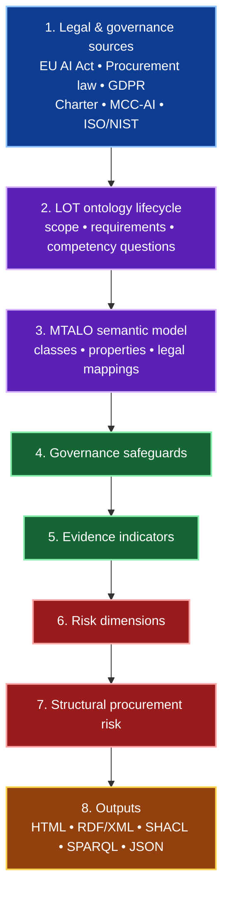

<div align="center">

# Trustworthy AI Forensics (TAF)

### *An ontology-supported framework for legally grounded procurement assessment of AI-enabled digital forensics tools*

[](https://w3id.org/taf)
[](#semantic-web-outputs)
[](#project-status)
[](LICENSE)

**Making AI forensic procurement evidence visible, traceable, and reviewable.**

[Why TAF](#why-taf) •
[Framework Architecture](#framework-architecture) •
[Framework Layers](#framework-layers) •
[Traceability Chain](#traceability-chain) •
[Expert Validation](#expert-validation-for-the-phd) •
[Semantic Web Outputs](#semantic-web-outputs) •
[Roadmap](#roadmap)

</div>

---

> [!IMPORTANT]
> **TAF helps turn legal and procurement obligations into traceable governance safeguards, evidence indicators, and procurement-risk signals for AI systems used in digital forensics.**
>
> TAF is **not** a final compliance engine or legal opinion.  
> It is a **research and expert-review support framework** for making procurement evidence more visible, structured, and auditable.

---

## Why TAF?

AI-enabled forensic tools are increasingly procured, deployed, and trusted in high-stakes investigations.

Traditional procurement documents often focus on vendor functionality, price, and service terms, but may not clearly expose whether the tool operationalises safeguards such as:

- chain of custody and evidence integrity;
- provenance, logging, and traceability;
- human oversight and escalation;
- bias, representativeness, and data-governance controls;
- cybersecurity, robustness, and resilience;
- transparency, auditability, and documentation.

**Trustworthy AI Forensics (TAF)** addresses this gap by modelling the relationship between legal provisions, procurement principles, governance safeguards, and textual evidence in procurement artefacts.

---

## At a glance

| Area | Summary |
|---|---|
| **Problem** | Procurement documentation may not clearly show whether AI-enabled forensic tools are governable, auditable, and trustworthy. |
| **TAF response** | TAF translates legal and governance expectations into ontology-backed safeguards, evidence indicators, and risk signals. |
| **Primary contribution** | A legally grounded, deterministic, ontology-supported screening framework for AI-forensic procurement artefacts. |
| **Outputs** | HTML dashboards, RDF/XML, SHACL-style artefacts, SPARQL queries, JSON mappings, and traceability structures. |
| **Research value** | Supports expert review, reproducibility, semantic traceability, and structured legal/governance interpretation. |

---

## Research contribution

TAF contributes an ontology-supported, legally grounded, deterministic screening framework for AI-forensic tool procurement.

Instead of only asking whether a tool performs well, TAF asks:

> **Does the procurement documentation show enough evidence that the system can be governed, audited, challenged, and trusted in a forensic context?**

The framework translates legal and procurement expectations into reusable semantic structures:

| Layer | Contribution |
|---|---|
| **Legal interpretation** | Identifies operational requirements from AI, procurement, data-protection, and forensic-governance sources. |
| **Competency questions** | Turns legal requirements into reviewable questions that structure ontology scope. |
| **Governance safeguards** | Abstracts recurring obligations into reusable safeguard categories. |
| **Evidence indicators** | Links safeguards to detectable terms, phrases, and source-wired procurement evidence. |
| **Risk dimensions** | Aggregates missing or weak evidence into structural procurement-risk signals. |
| **Semantic exports** | Produces machine-readable ontology and validation artefacts for review and reuse. |

---

## Framework architecture

### Visual overview



<details>
<summary><strong>Can’t read the Mermaid diagram clearly on GitHub?</strong> Click for the full architecture breakdown.</summary>

### Full architecture breakdown

| Step | Component | What it does |
|---:|---|---|
| **1** | **Legal & governance sources** | Provides the normative foundation of the framework, including the **EU AI Act**, **procurement law**, **GDPR**, **Charter rights**, **MCC-AI**, and relevant **ISO/NIST** material. |
| **2** | **LOT ontology lifecycle** | Structures the ontology-engineering process through scope definition, requirements capture, and competency questions. |
| **3** | **MTALO semantic model** | Formalises the ontology through classes, properties, legal mappings, and semantic relations. |
| **4** | **Governance safeguards** | Identifies the governance controls and safeguards that should be evidenced in procurement artefacts. |
| **5** | **Evidence indicators** | Maps safeguards to specific textual indicators, phrases, or evidence signals found in procurement documentation. |
| **6** | **Risk dimensions** | Groups weak or missing evidence into broader governance-risk categories. |
| **7** | **Structural procurement risk** | Produces an interpretable procurement-risk signal based on the presence or absence of relevant evidence. |
| **8** | **Outputs** | Publishes results in both human-readable and machine-readable forms, including **HTML**, **RDF/XML**, **SHACL**, **SPARQL**, and **JSON** outputs. |

### Simple flow summary

```text
Legal & governance sources
    -> LOT ontology lifecycle
    -> MTALO semantic model
    -> Governance safeguards
    -> Evidence indicators
    -> Risk dimensions
    -> Structural procurement risk
    -> Outputs
```

</details>

---

## Framework layers

The generated TAF report is organised into six reporting layers. These are report and artefact layers; the LOT methodology is used as the ontology-engineering lifecycle inside the framework.

| # | Layer | Purpose |
|---:|---|---|
| **1** | **LOT ontology lifecycle / requirements layer** | Defines scope, stakeholders, use cases, competency questions, source materials, and maintenance points. |
| **2** | **MTALO semantic layer** | Formalises legal provisions, safeguards, principles, ontology classes, properties, and namespaces. |
| **3** | **TAF operational screening layer** | Produces contract records, coverage interpretation, legal assessment, traceability dashboards, and source-wired evidence tables. |
| **4** | **Validation / reporting layer** | Captures validation posture, TBox/ABox distinction, ground-truth planning, and ablation testing. |
| **5** | **Semantic export layer** | Publishes RDF/XML, SHACL-style shapes, SPARQL queries, JSON mappings, and ontology previews. |
| **6** | **Thesis finalisation and validation roadmap** | Documents remaining ontology-quality, expert-validation, and publication steps. |

---

## Traceability chain

TAF makes the evidence chain explicit:

```text
LegalProvision
  -> LegalSubProvision
  -> CompetencyQuestion
  -> GovernanceSafeguard
  -> EvidenceIndicator
  -> RiskDimension
  -> StructuralProcurementRisk
```

### Example interpretation path

```text
EU AI Act Article 10
  -> Data provenance and suitability
  -> Must documentation enable assessment of compliance?
  -> Forensic chain of custody and data integrity
  -> chain of custody, data provenance, hash verification, audit trail
  -> transparency / auditability risk
  -> structural procurement risk
```

The goal is to avoid a shallow jump from **law -> keywords**.  
TAF inserts an interpretation layer so that legal intent is preserved before deterministic screening is applied.

---

<details>
<summary><strong>Who is this for?</strong></summary>

| Stakeholder | How TAF helps |
|---|---|
| **AI system providers** | Understand the evidence customers may expect in procurement documentation. |
| **Customers and deployers** | Assess whether vendor artefacts expose governance, oversight, and forensic safeguards. |
| **Regulators and policymakers** | Observe recurring documentation gaps and support regulatory-learning or sandbox preparation. |
| **Researchers** | Reuse the ontology, traceability chain, and evaluation method for trustworthy AI procurement research. |

</details>

<details>
<summary><strong>Core ontology vocabulary</strong></summary>

| Concept | Meaning |
|---|---|
| `LegalProvision` | A source legal or regulatory provision relevant to AI-enabled forensic procurement. |
| `LegalSubProvision` | A more specific operational requirement extracted from a legal provision. |
| `CompetencyQuestion` | A review question used to test whether the ontology operationalises the requirement. |
| `GovernanceSafeguard` | A reusable safeguard category such as human oversight, logging, or data governance. |
| `EvidenceIndicator` | A detectable textual signal in procurement documentation. |
| `RiskDimension` | A governance-risk dimension affected by missing or weak evidence. |
| `StructuralProcurementRisk` | The resulting procurement-risk interpretation based on evidence coverage and safeguard strength. |

</details>

<details>
<summary><strong>Example safeguard areas</strong></summary>

| Safeguard area | Example evidence indicators |
|---|---|
| **Forensic chain of custody and data integrity** | chain of custody, hash verification, secure acquisition, evidence integrity, audit trail |
| **Traceability and logging** | event logging, provenance tracking, timestamping, reconstruction, monitoring |
| **Human oversight** | human-in-the-loop, manual review, operator override, escalation, supervision |
| **Data governance** | data quality, data lineage, representativeness, retention, GDPR, data minimisation |
| **Accuracy, robustness, and cybersecurity** | validation, testing, benchmarking, resilience, vulnerability management |
| **Transparency and documentation** | technical documentation, instructions for use, service levels, supplier cooperation |

</details>

<details>
<summary><strong>Legal and governance sources</strong></summary>

TAF is designed around selected legal, procurement, AI-governance, cybersecurity, and digital-forensic sources, including:

- **EU AI Act** — high-risk AI obligations relevant to risk management, data governance, logging, transparency, human oversight, accuracy, robustness, and cybersecurity.
- **Directive 2014/24/EU** — procurement fairness, equal treatment, transparency, proportionality, and documentation.
- **GDPR** — data protection, minimisation, provenance, and personal-data governance.
- **Charter of Fundamental Rights** — fundamental-rights risk visibility.
- **MCC-AI high-risk model clauses** — contractual controls and supplier obligations.
- **ISO/IEC 27037, 27041, and 27042** — digital forensic evidence handling and method assurance.
- **ISO/IEC 42001 and ISO MSS concepts** — AI management-system interpretation.
- **NIST AI RMF** — AI risk-management vocabulary and governance framing.

</details>

---

## Semantic Web outputs

The framework is intended to support both human review and machine-readable reuse.

| Artefact | Purpose | Status |
|---|---|---|
| `mtalo_complete_protege_ready.rdf` | Protégé-targeted RDF/XML ontology export | ✅ |
| `mtalo_shapes.rdf` | SHACL-style validation constraints | ✅ |
| `mtalo_queries.rq` | SPARQL queries for inspecting ontology and ABox patterns | ✅ |
| `mtalo_export_manifest.json` | Export manifest and publication metadata | ✅ |
| `competency_questions.json` | Reviewable competency-question source file | ✅ |
| `mcc_ai_checker_output.html` | Human-readable report and audit dashboard | ✅ |

<details>
<summary><strong>Suggested repository layout</strong></summary>

```text
taf/
├── README.md
├── LICENSE
├── ontology/
│   ├── mtalo_complete_protege_ready.rdf
│   ├── mtalo_shapes.rdf
│   └── mtalo_queries.rq
├── data/
│   ├── competency_questions.json
│   └── source_materials/
├── reports/
│   └── mcc_ai_checker_output.html
├── docs/
│   └── widoco/
└── scripts/
    └── mcc_ai_checker.py
```

</details>

---

## How to use

<details open>
<summary><strong>Open usage guidance</strong></summary>

### View the public project

```text
https://w3id.org/taf
```

### Inspect the ontology

Open the RDF/XML export in Protégé or another OWL/RDF tool:

```text
ontology/mtalo_complete_protege_ready.rdf
```

### Run SPARQL review queries

Use the SPARQL query file to inspect relationships such as:

- legal provisions linked to safeguards;
- safeguards linked to evidence indicators;
- evidence indicators linked to risk dimensions;
- contract instances with missing or weak evidence;
- repeated structural procurement-risk patterns.

```text
ontology/mtalo_queries.rq
```

### Review the HTML report

Open the generated report to inspect the human-readable traceability dashboard:

```text
reports/mcc_ai_checker_output.html
```

</details>

---

## Project status

### Summary

| Area | Status |
|---|---|
| **Overall maturity** | 🟡 Research prototype |
| **Core ontology design** | ✅ Implemented |
| **Traceability model** | ✅ Implemented |
| **HTML reporting** | ✅ Implemented |
| **Semantic exports** | ✅ Implemented |
| **Expert validation** | 🟡 Minimum still required |
| **Final thesis-grade validation** | 🟡 Still to complete |
| **Automated legal conclusions** | ❌ Not claimed |

### Completed / implemented in the current prototype

- ✅ LOT-aligned ontology lifecycle framing
- ✅ MTALO semantic model and vocabulary
- ✅ Legal-provision to governance-safeguard traceability
- ✅ Competency-question driven requirements structure
- ✅ Contract evidence screening dashboard
- ✅ Legal-provision -> safeguard -> evidence-indicator -> risk-dimension mapping
- ✅ RDF/XML ontology export preview
- ✅ SHACL-style validation artefacts
- ✅ SPARQL query artefacts
- ✅ JSON mapping / manifest-style publication artefacts
- ✅ Human-readable HTML report output

---

## Expert validation for the PhD

### Bare minimum for PhD-level validation

For a **credible PhD minimum**, the README should state that TAF still requires a **small but defensible expert-validation exercise** focused on the interpretation layers of the framework.

A reasonable **bare minimum** is:

- **5 to 8 experts** in total;
- covering a mix of:
  - **AI / trustworthy AI governance**
  - **digital forensics**
  - **public procurement / procurement law**
  - **data protection / legal or regulatory interpretation**
- using a **structured review instrument** such as:
  - relevance / clarity / completeness scoring;
  - mapping-validity review;
  - comments on missing safeguards or misleading evidence indicators;
  - review of worked examples or example procurement records.

> [!TIP]
> This does **not** need to be a huge validation study to be PhD-credible.  
> A focused expert review with a clear protocol, transparent criteria, and documented feedback can be enough as a **minimum validation stage**, especially when positioned honestly as prototype validation rather than final industrial certification.

### What expert validation is still required for

Expert validation is **not** required to prove that the code runs or that the README exists.  
It is required for the **research claims and interpretation layers** of the framework.

| Validation area | Why expert input is needed |
|---|---|
| **Legal interpretation** | To confirm that the selected EU AI Act, procurement, GDPR, Charter, MCC-AI, ISO/NIST, and forensic-governance sources are interpreted appropriately. |
| **Competency questions** | To confirm that the questions are relevant, complete, and suitable for assessing AI-forensic procurement evidence. |
| **Ontology modelling choices** | To confirm that MTALO classes, properties, and relationships are meaningful to legal, procurement, AI-governance, and digital-forensic reviewers. |
| **Safeguard mapping** | To confirm that legal requirements are mapped to suitable governance safeguards rather than superficial keyword categories. |
| **Evidence indicators** | To confirm that selected keywords and phrases are reasonable signals of procurement evidence, and to identify missing or misleading indicators. |
| **Risk dimensions** | To confirm that missing evidence is assigned to appropriate risk dimensions. |
| **Legal sufficiency labels** | To confirm whether labels such as sufficient, partial, weak, or missing are defensible as research classifications. |
| **Worked examples / ABox instances** | To confirm that example procurement records are interpreted fairly and consistently. |

### Validation status snapshot

| Validation element | Status |
|---|---|
| Framework prototype implemented | ✅ Done |
| Ontology and mappings drafted | ✅ Done |
| Human-readable and semantic outputs generated | ✅ Done |
| Expert-validation protocol fully documented | 🟡 Still needed / can be minimal |
| Expert review exercise completed | 🟡 Still needed |
| Final thesis-grade validation write-up | 🟡 Still needed |

---

## Limitations

TAF deliberately avoids claiming automated legal compliance.

Known limitations include:

- legal source coverage may be incomplete;
- semantic matching may miss procurement wording that differs from the ontology vocabulary;
- evidence indicators can generate false positives without expert review;
- supplier documentation quality affects the assessment;
- legal sufficiency remains an experimental research classification;
- the framework supports review, not final conformity assessment.

---

## Roadmap

### Status legend

- ✅ **Done**
- 🟡 **Partly done / needs refinement**
- ⬜ **Still to do**

### Roadmap table

| Item | Status | Notes |
|---|---|---|
| Public project landing page via `https://w3id.org/taf` | ✅ | Available |
| GitHub README describing the TAF framework | ✅ | Implemented |
| MTALO ontology vocabulary | ✅ | Implemented in current prototype |
| RDF/XML ontology export preview | ✅ | Implemented |
| SHACL-style validation artefacts | ✅ | Implemented |
| SPARQL query artefacts | ✅ | Implemented |
| JSON mapping / manifest artefacts | ✅ | Implemented |
| Human-readable HTML report output | ✅ | Implemented |
| Legal-provision -> safeguard traceability | ✅ | Implemented |
| Safeguard -> evidence-indicator mapping | ✅ | Implemented |
| Evidence-indicator -> risk-dimension mapping | ✅ | Implemented |
| Stable ontology namespace under `https://w3id.org/taf#` | 🟡 | Partly there via public identifier, but formal namespace publication can be strengthened |
| Turtle and JSON-LD exports | 🟡 | RDF/XML exists; other serialisations still to add or tidy |
| Expanded SHACL validation profiles | 🟡 | Prototype-level support exists; expansion still needed |
| SPARQL examples with explanatory documentation | 🟡 | Queries exist; documentation can be improved |
| Anonymised sample procurement records for public release | 🟡 | Conceptually aligned; publishable examples still needed |
| Versioned thesis artefact packages | 🟡 | Can be improved with clearer release packaging |
| Full WiDoco ontology documentation | ⬜ | Still to do |
| Expert-validation protocol and scoring rubric | ⬜ | Still to do formally |
| Expert validation exercise with reviewers | ⬜ | Still to do |
| CI checks for ontology consistency, RDF parsing, SHACL checks, and broken links | ⬜ | Still to do |
| GitHub release tags for thesis artefact versions | ⬜ | Still to do |
| Final archived release for examination / reproducibility | ⬜ | Still to do |

<details>
<summary><strong>Checklist view</strong></summary>

#### Done
- [x] Create public project landing page through `https://w3id.org/taf`
- [x] Publish a GitHub README describing the TAF framework
- [x] Define the MTALO ontology vocabulary
- [x] Produce RDF/XML ontology export preview
- [x] Produce SHACL-style validation artefacts
- [x] Produce SPARQL query artefacts
- [x] Produce JSON mapping / manifest artefacts
- [x] Produce human-readable HTML report output
- [x] Implement legal-provision to safeguard traceability
- [x] Implement safeguard to evidence-indicator mapping
- [x] Implement evidence-indicator to risk-dimension mapping

#### Partly done / needs refinement
- [ ] Publish a stable ontology namespace under `https://w3id.org/taf#`
- [ ] Add complete Turtle and JSON-LD exports alongside RDF/XML
- [ ] Expand SHACL validation profiles beyond the current prototype checks
- [ ] Add SPARQL examples with explanatory documentation
- [ ] Add anonymised sample procurement records suitable for public release
- [ ] Add clearer versioned release packages for thesis artefact submission

#### Still to do
- [ ] Generate full WiDoco ontology documentation
- [ ] Add expert-validation protocol and scoring rubric
- [ ] Run expert validation with legal, procurement, AI-governance, and digital-forensic reviewers
- [ ] Add CI checks for ontology consistency, RDF parsing, SHACL checks, and broken links
- [ ] Add GitHub release tags for thesis artefact versions
- [ ] Add a final archived release for examination / reproducibility

</details>

---

## Citation

```bibtex
@misc{mccabe_taf,
  author       = {McCabe, Darren},
  title        = {Trustworthy AI Forensics (TAF): An ontology-supported framework for AI forensic tool procurement governance},
  howpublished = {\url{https://w3id.org/taf}},
  year         = {2026},
  note         = {Research prototype / PhD artefact}
}
```

---

## License

This project is released under the [MIT License](LICENSE).

---

<div align="center">

**Trustworthy AI Forensics (TAF)**  
*An ontology-supported approach to making AI-forensic procurement evidence more transparent, structured, and reviewable.*

</div>
